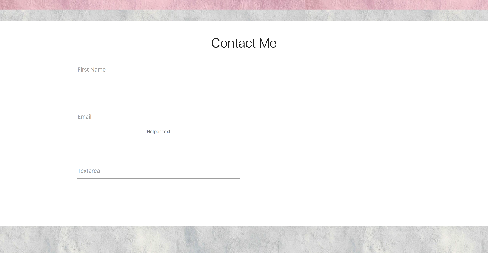

# Portfolio
> This portfolio application has a simple looks to it with three tabs, one for about me that includes a profile picture , one for portfolio that contains my projects with their deployed links and a third tab for contact me. 

## Table of contents
* [General-info](#General-info)
* [Screenshots](#screenshots)
* [Technologies](#technologies)
* [Setup](#setup)
* [Features](#features)
* [Status](#status)
* [Inspiration](#inspiration)
* [Contact](#contact)

## General-info:
This application has used features such as parallax effect, grid system, shadow effect and many more and it creates a pleasant look for the user to interact with it.

## Screenshots

## Technologies
* built with materialize for style: [materialize](https://materializecss.com/getting-started.html)

* additional source for style: [freetimelearning](http://www.freetimelearning.com/materialize-css/)

## Setup
To view this portfolio you can click : [here](https://zahraaliaghazadeh.github.io/portfolio2/index.html)

## Features
* feature 1: This app has the responsive ability, it can customize its sizes depending on changes to the screen.
* feature 2: responsive tabs to open once clicked for portfolio and contact me.

To-do list:
* improvement to be done 1: Improoving the design such as finding better colors and alignment of photos and texts.
* improvement to be done 2: It has to improve in terms of adjusting the screen size.

## Status
Portfolio is: _in progress_, as there will be more projects in the course to be added.

## Inspiration
A start to having an outstanding portfolio has been the inspiration.

## Contact
Email: zahraaliaghazadeh@gmail.com

LinkedIn: [LinkedIn](https://www.linkedin.com/in/yalda-aghazade-7a9b0390)

feel free to contact me!
